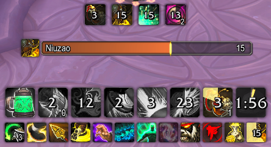
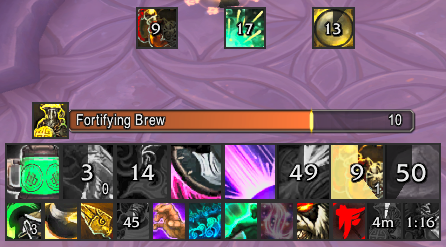
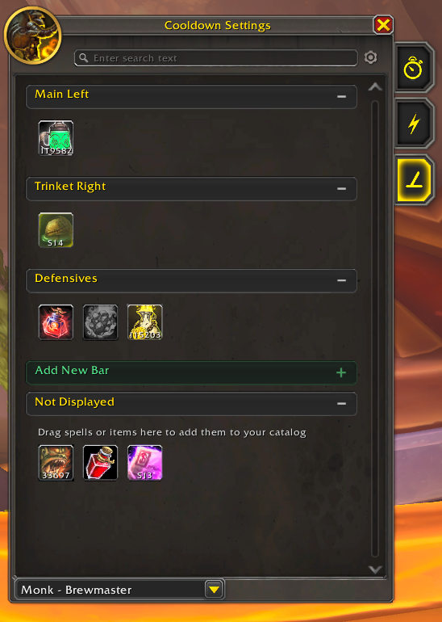

# BuckleUp Sidecar

`BuckleUp Sidecar` is a lightweight World of Warcraft addon that extends Blizzard's native Cooldown Manager instead of replacing it.

If you like Blizzard's cooldown system but want a clean place for the things Blizzard does not handle well by default, Sidecar gives you that extra space without turning your UI into a full cooldown replacement addon.

Blizzard keeps ownership of Blizzard-managed spell cooldowns and built-in aura behavior. Sidecar focuses on the supplemental pieces:

- trinkets
- racials
- items
- additional spells

_Sidecar extends Blizzard's cooldown bars with trinkets, racials, and custom utility while keeping the same visual language._

## Why Try It

Sidecar is for players who:

- like Blizzard's default cooldown manager and want to keep using it
- want a clean place for racials, trinkets, potions, healthstones, and niche utility
- want addon-owned bars that still feel like part of Blizzard's UI
- do not want a giant all-in-one cooldown replacement

In short: Sidecar gives Blizzard's cooldown manager a little more room to breathe.

## What Makes It Different

- it works with Blizzard's cooldown manager rather than competing with it
- it embeds directly into Blizzard's cooldown settings
- Sidecar bars are placed in Blizzard Edit Mode and can snap to Blizzard UI
- bars can live-match Blizzard presentation settings
- an optional unified visual style can make Sidecar and Blizzard cooldowns look a bit more modern

_Optional unified visual style keeps Blizzard and Sidecar cooldowns visually aligned with square icons, tighter crop, and matching borders._

## Key Features

- embedded `Sidecar` tab inside Blizzard's cooldown settings
- drag-and-drop organizer with user bars
- drag a spell from your spellbook or an item from your bags into Sidecar to add it
- create, rename, and delete Sidecar bars
- move and adjust Sidecar bars in Blizzard Edit Mode
- optional live `Match Essential Bar` / `Match Utility Bar` presentation modes
- optional unified square-style visual treatment for both Sidecar and Blizzard cooldown viewers
- spec-based bar assignments with copy/import support
- account-wide custom item/spell catalog

## Placement And Customization

Sidecar bars are moved in Blizzard Edit Mode.

Sidecar bars can:

- snap to Blizzard cooldown viewers and other Blizzard UI elements
- keep following Blizzard elements after being placed
- use a Sidecar-owned Edit Mode panel that feels consistent with Blizzard's settings flow
- have their own styling, match the Blizzard Essential Bar, or match the Blizzard Utility Bar

When match mode is enabled, Sidecar follows the matched Blizzard bar's presentation settings live.

_Sidecar bars move in Blizzard Edit Mode, snap to Blizzard UI, and keep following the elements they are anchored to._

## Slash Commands

- `/bus config` opens Blizzard's Cooldown Viewer settings and shows the Sidecar panel
- `/bus remove <entryID|rawID>` removes a custom entry by entry ID or raw spell/item ID

## Limitations

- this is not a replacement cooldown manager
- Blizzard-owned spell cooldowns are intentionally left to Blizzard
- Sidecar focuses on reliable supplemental cooldown display, not complete Blizzard aura-parity emulation

## Feedback / Bugs

If you try the addon and run into issues, feedback is encouraged.

Bug reports are especially useful if they include:

- class/spec
- what Blizzard bar(s) you were matching, if any
- whether unified visual style was enabled
- what you expected to happen
- what actually happened

## License

MIT. See [LICENSE](https://github.com/safetybelt/BuckleUp-Sidecar/blob/main/LICENSE).
